# SD Model Organizer

SD Model Organizer is a [Stable Diffusion WebUI](https://github.com/AUTOMATIC1111/stable-diffusion-webui]) extension
that allows to store and manage own model collections, add information, own notes, previews about model. Easily download
from any external direct link or shared file link from Google Drive. Share own models collection with json file or use
remote Firestore database to make it available and synced on several devices.

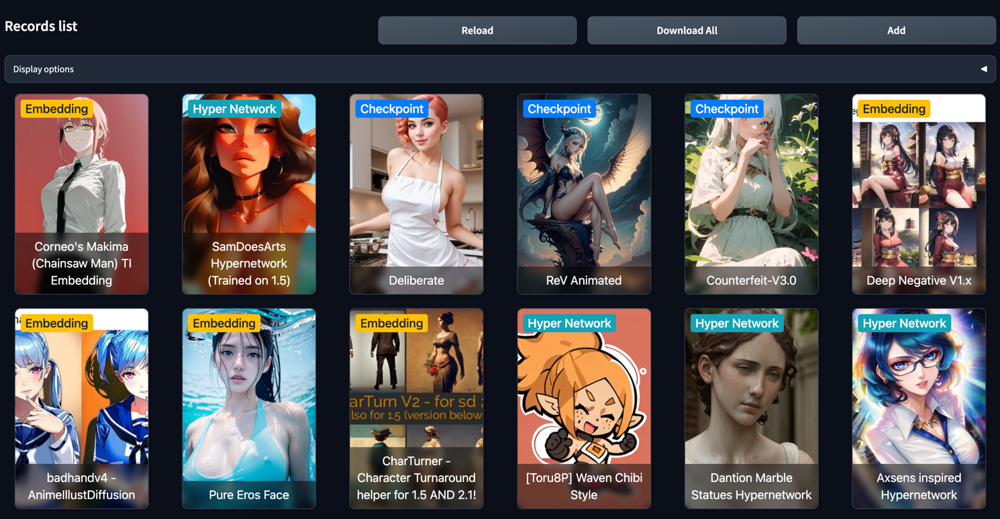

  

## 🚀 Core features

- Sort model records by time added, name, model types, groups and search by name.
- Downloads model with single click
- Downloads batch of models regarding to the filter applied on home screen.
- Downloads models to the model type predefined path or manually selected.
- Downloads models into subdirectories.
- Downloads model's image preview to make it visible in additional networks.
- Bind new record with already existing model file locally.
- Add image external url as model's preview.
- Add model description and own notes with rich text editor (TinyMCE)
- Stores model records in local SQLite database.
- Stores model records in remote Firebase Firestore.
- Export/import existing model as json files.
- Import models from civitai.com url or model id.
- Import models info from .info file.
- List local model files.
- Remove local files related to model.
- Dark/Light theme support.

  
**Readme file will be updated soon regarding to 1.1 updates.**

**Use `--mo-show-dir-settings` param to show models path parameters in seettings menu**
  

## 1. Home Screen

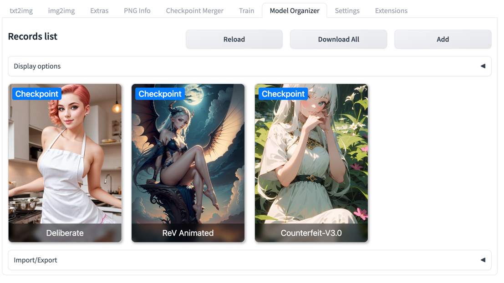
The main screen of the extension. Displays already added records. May be configured
to display content as cards or table layout in the webui settings.

  

### 1.1 Controls

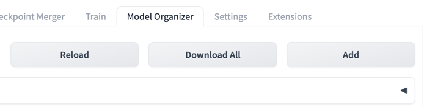

- **Reload** - Allows to reload data from the storage manually. Avoid using page refresh - it will load only initial
  data from Gradio.
- **Download All** - Redirects to the download screen and adds all records displayed on the home screen to the download
  queue.
- **Add** - Redirects to the Add Record screen.

  

### 1.2 Display Options

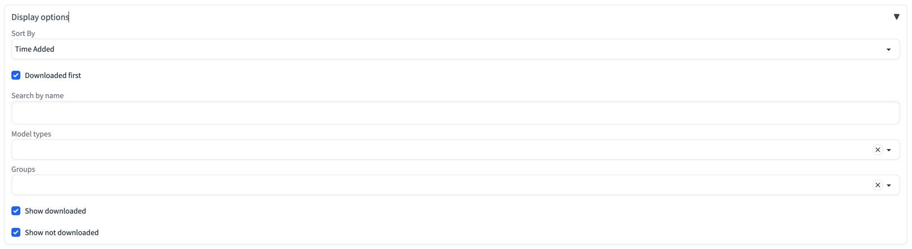
Display options is an accordion that hides sorting and filtering options to be applied for records to show on home
screen.

- **Sort By** - Allows to sort records by `Time Added`, `Time Added Reversed`, `Name` and `Name Reveresed`.
- **Download first** - Downloaded records will be displayed first in the list if checked.
- **Search by name** - Allows to search records by name, not case-sensitive.
- **Model types** - Filters records by selected model types.
- **Groups** - Filters records by selected record groups.
- **Show downloaded** - Shows downloaded records if checked.
- **Show not downloaded** - Shows not downloaded records if checked.

  

### 1.3 Cards

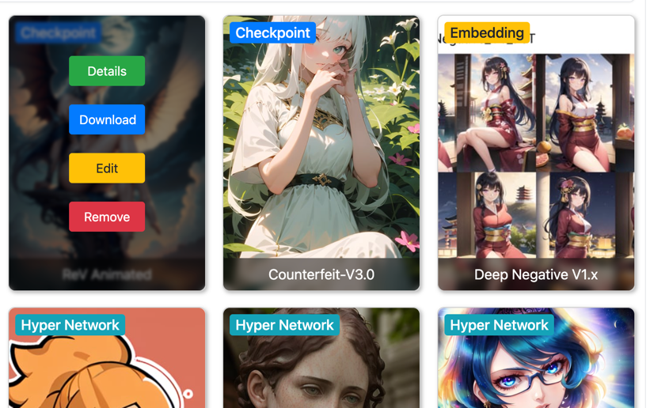
After mouse hovering above record card, card options will be displayed:

- **Details** - Redirects to the details screen of the current record.
- **Download** - Redirects to the download screen and adds current records to the download queue. Visible only if models
  isn't downloaded yet.
- **Edit** - Redirects to the record editing screen.
- **Remove** - Redirects to the record removal screen.

  

### 1.4 Import/Export

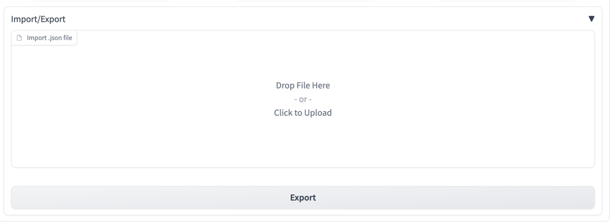
`Import/Export` Accordion is placed in the bottom of the home screen, click to expand it.

- **Import** - Drag and drop .json file with records to import it to the current selected storage. **Note: existing
  records will not be merged with new ones. Imported records will be added as new.**
- **Export** - Click to export records displayed on the home screen (Only displayed will be exported, regarding to the
  filters applied). Click on download button to download it from the browser, or navigate to
  the `<your_extensions_dir>/sd-model-organizer/export` dir.

  

## 2. Add/Edit Record screen

### 2.1 Input Fields

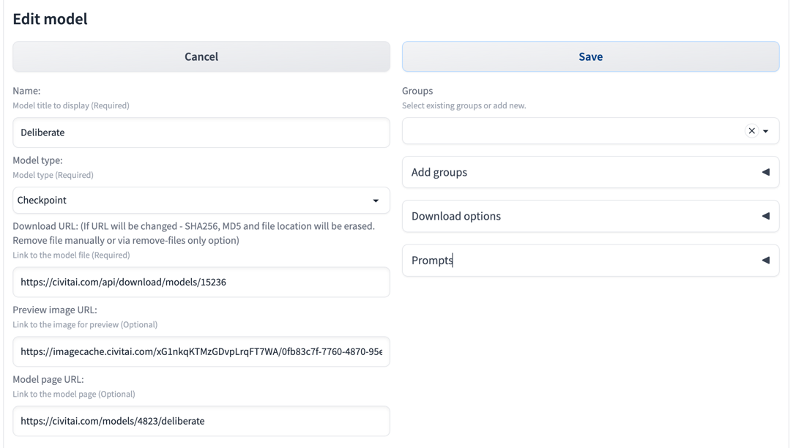

- **Cancel** - Click to cancel record adding/editing and return to previous screen.
- **Save** - Saves or adds new model and returns to previous screen.
- **Name** - Model title to display (Required)
- **Model type** - Dropdown to select record's model type. Currently
  supported `Checkpoint`, `VAE`, `Lora`, `Hyper Network`, `Embedding` and other `Other`. If `Download path` is not
  defined in the `Download options` section, model will be downloaded to the default model's path defined in webui. Also
  default path might be changed in the extension settings. **Note: `Other` type requires to `Download path` to be set
  in the `Download Options`**
- **Download URL** - Link to the model file to download (Required). **Note: if URL will be changed during editing -
  SHA256, MD5 and file location will be erased. Remove file manually or via remove-files only option**
- **Preview image URL** - Link to the image for preview. Image will be downloaded if `Download preview` options is
  checked in the extension settings.
- **Model page URL** - Link to the model page information.
- **Bind with existing** - Textbox appears below `Add Groups` section when record doesn't have location after
  downloading model and user selects
  model type, and it's directory contains files not related to any of records added before.

  

### 2.2 Groups

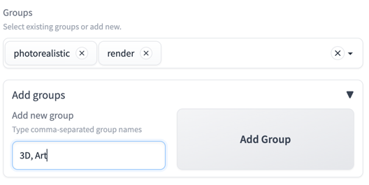
Groups dropdown allows to add groups to the current record from already existing records or add new ones by
expanding `Add Groups` accordion. Type comma-separated group names in the textbox and press `Add Group` button to add
new groups.

  

### 2.3 Download options

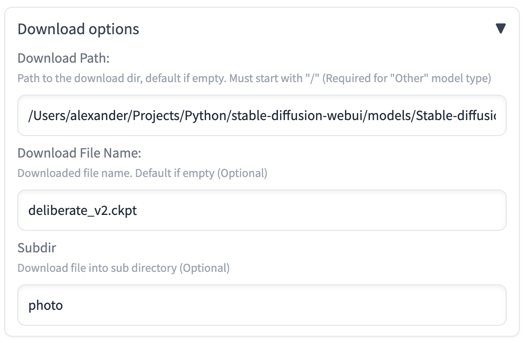
Download options section allows to configure download destination of model's file.

- **Download Path** - Path to the download dir, default if empty. (Required for "Other" model type)
- **Download File Name** - Downloaded file name. Default if empty.
- **Subdir** - Downloads file into subdirectory. (for example: `{webui_path}/models/Stable Diffusion/photo/`)

  

### 2.4 Prompts

Prompts sections allows to note positive and negative prompts of the model record.

  

### 2.5 Description

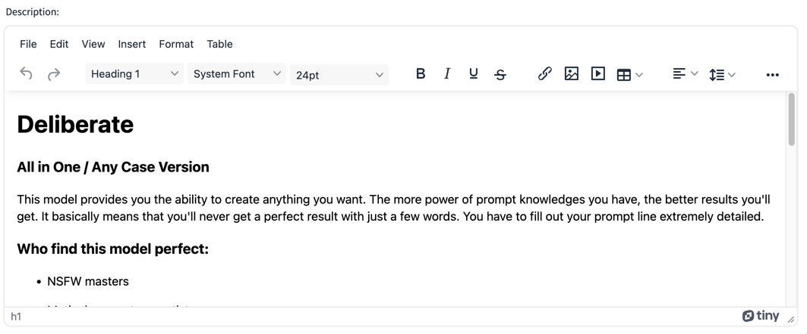
Description is textfield that support Rich Text editing with TinyMCE editor.
Supports different text-styles, links, images, videos, tables and pasting text from clipboard with styles.

  

## 3. Record Details screen

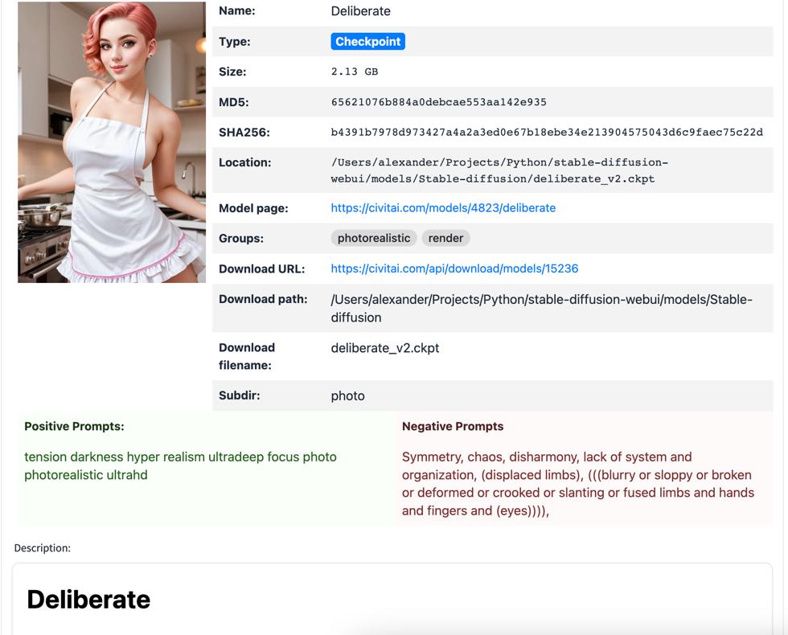
Screen that displays all record's information available:

- **Name** - Record name.
- **Model Type** - Model type.
- **Size** - Size of model's file in case it was downloaded.
- **MD5** - Model's md5 hash in case it was downloaded.
- **SHA256** - Model's sha256 hash in case it was downloaded.
- **Location** - File path in case model was downloaded.
- **Model page** - Link to the model's page if it was added.
- **Groups** - Model's groups.
- **Download URL** - Model's download link.
- **Download path** - Download destination directory.
- **Download filename** - Download destination file name.
- **Subdir** - Download destination subdirectory.
- **Positive Prompts** - Positive prompts text if it was added.
- **Negative Prompts** - Negative prompts text if it was added.
- **Description** - Formatted description text.

  

## 4. Download screen

Download screen contains cards with records selected for downloading. Each card contains current state of download
progress for each separate record.

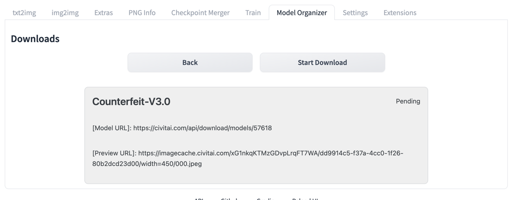

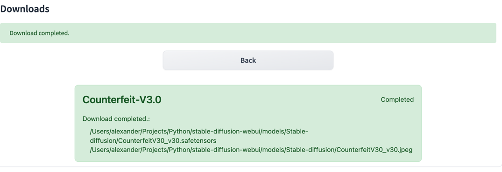

  

## 5. Record Removal screen

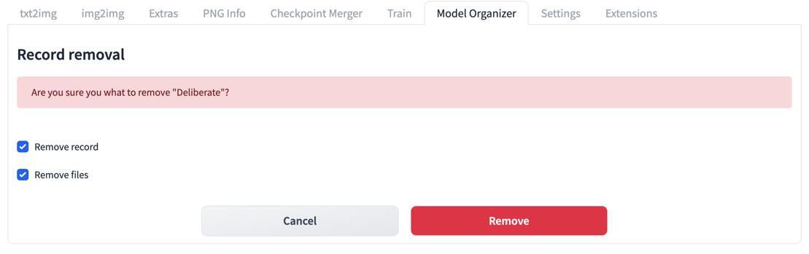
Removal screen allows to remove record itself or with files if record was downloaded and files are available.

  

## 6. Extension settings

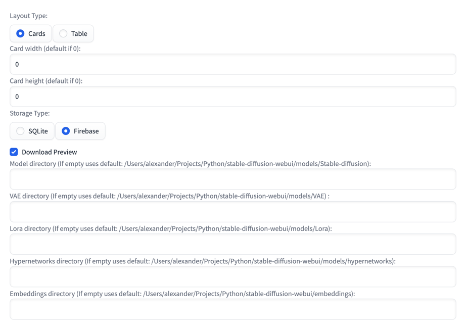
SD Model Organizer's settings in the webui `Settings Tab` -> `Model Organizer` Menu.

- **Layout Type** - Layout type displayed on home screen. Currently two options available `Cards` or `Table`.
- **Card width** - Card's width on home screen. Default value will be used if 0.
- **Card height** - Card's height on home screen. Default value will be used if 0.
- **Storage Type** - Storage type to store model records. `SQLite` is selected by default and stores data
  in `{sd-webui}/extensions/sd-model-organizer/database.sqlite` file. `Firebase` option allows to store records data in
  the remove Firestore database, follow instruction in the separate section of this page for setup.
- **Download Preview** - Enabled downloading models preview with model. Checked by default.
- **Blur NSFW Previews** - Blur in image previews for models tagged (grouped) as nsfw.✨
- **Model directory** - Model's directory to download checkpoints, uses default path if empty.
- **VAE directory** - VAE directory to download VAE files, uses default path if empty.
- **Lora directory** - Lora directory to download Lora files, uses default path if empty.
- **Hypernetworks directory** - Hypernetworks directory to download Hypernetworks files, uses default path if empty.
- **Embeddings directory** - Embeddings directory to download Embeddings files, uses default path if empty.

  

## 7. Firestore setup

- install `pip install firebase-admin==4.5.0` (latest firebase-admin (6.1.0) has an incompatible protobuf (4.22.0)
  version
  dependency. But tensorboard requires 3.20.0 Firebase version that should work fine is 4.5.0.

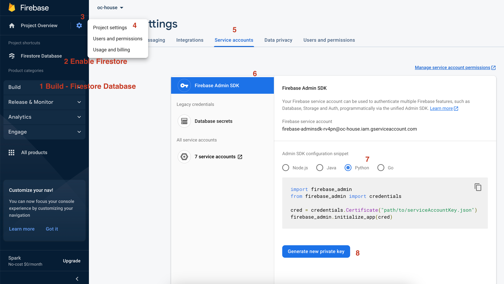

- Go to https://console.firebase.google.com/
- Create a new project
- Open a project and navigate to the `Build -> Firestore Database` in the left-side menu.
- Enable `Firestore Database`.
- Go to `Project settings`, `Service Accounts` Tab, Select `Firebase Admin SDk`, click on `Generate new private key`.
- Download json file, move it to the `{sd-webui}/extensions/sd-model-organizer` directory and rename
  to `service-account-file.json`
- Restart webui.

**Note:** Keep this file safe and don't use service account keys from projects that contains any sensitive data.

  

## 📦 Installation

The SD Model Organizer can be installed from the Stable Diffusion WebUI. Simply navigate to the `Extensions` tab, click
on `Install from URL`, paste link to this repository, click `Install` button and reload webui.

Manually:

Clone repository into your extensions folder, install `bs4` and `firebase-admin==4.5.0` if you are going to use Firebase
storage type packages with pip, restart webui if needed.

  

## 🤝 Contributing

Contributions, issues, and feature requests are welcome! Feel free to check out the issues page if you want to
contribute. Please keep in mind I'm not a Python/JS/Gradio developer. I'm new to these technologies stack and my overall
experience with it is about one month only.

  

## 📝 License

This project is licensed under the MIT License. Feel free to use, modify, and distribute it as you wish.

  

## Models on screenshots

- [Deliberate](https://civitai.com/models/4823/deliberate)
- [Counterfeit-V3.0](https://civitai.com/models/4468/counterfeit-v30)
- [Corneo's Makima (Chainsaw Man) TI Embedding](https://civitai.com/models/5331/corneos-makima-chainsaw-man-ti-embedding)
- [SamDoesArts Hypernetwork (Trained on 1.5)](https://civitai.com/models/1187/samdoesarts-hypernetwork-trained-on-15)
- [ReV Animated](https://civitai.com/models/7371/rev-animated)
- [Deep Negative V1.x](https://civitai.com/models/4629/deep-negative-v1x)
- [badhandv4 - AnimeIllustDiffusion](https://civitai.com/models/16993/badhandv4-animeillustdiffusion)
- [Pure Eros Face](https://civitai.com/models/4514/pure-eros-face)
- [CharTurner - Character Turnaround helper for 1.5 AND 2.1!](https://civitai.com/models/3036/charturner-character-turnaround-helper-for-15-and-21)
- [[Toru8P] Waven Chibi Style](https://civitai.com/models/4379/toru8p-waven-chibi-style)
- [Dantion Marble Statues Hypernetwork](https://civitai.com/models/3810/dantion-marble-statues-hypernetwork)
- [Axsens inspired Hypernetwork](https://civitai.com/models/4796/axsens-inspired-hypernetwork)
